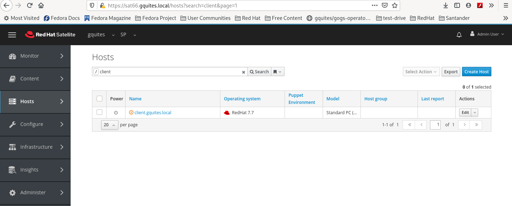
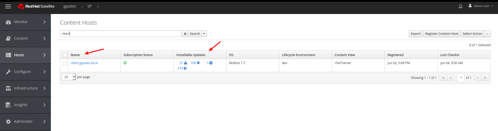
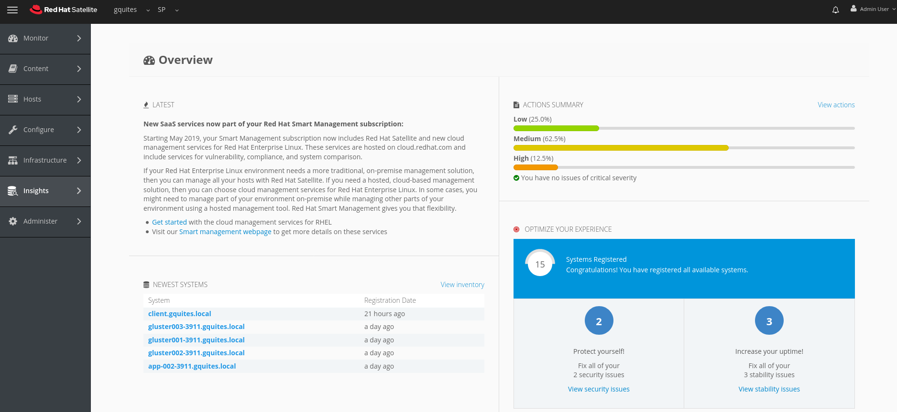
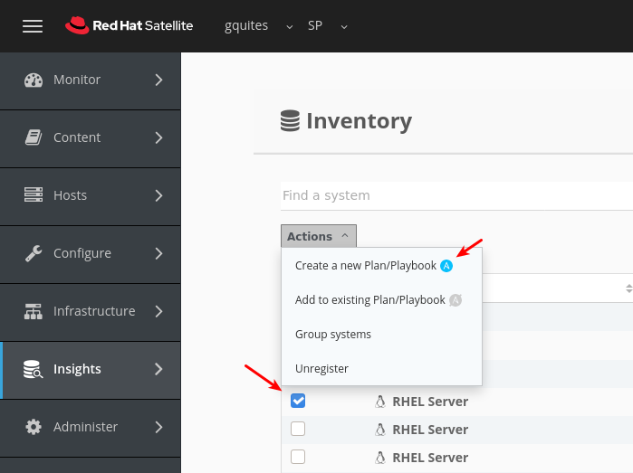
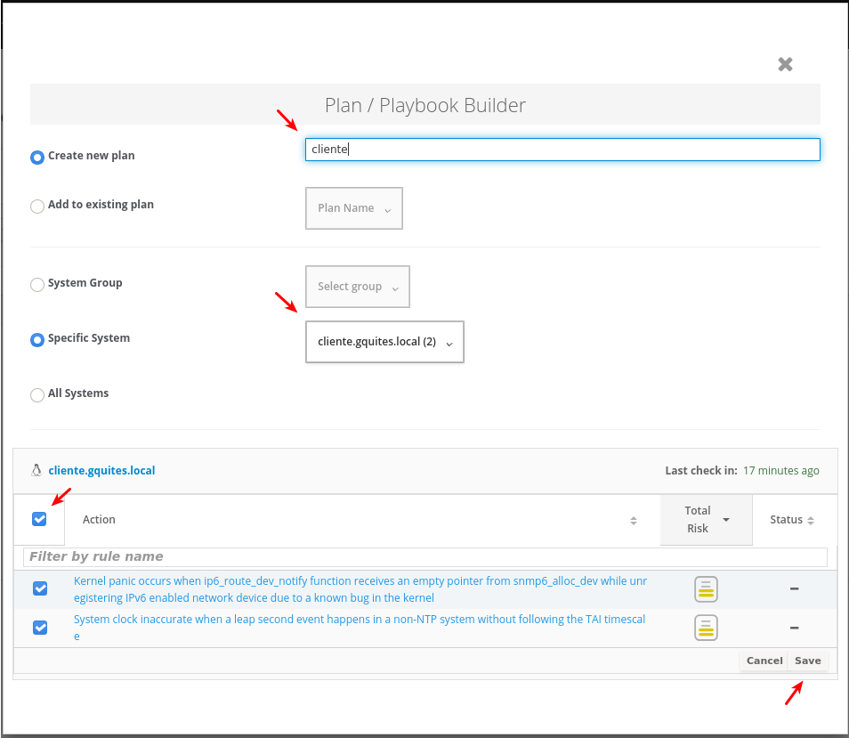
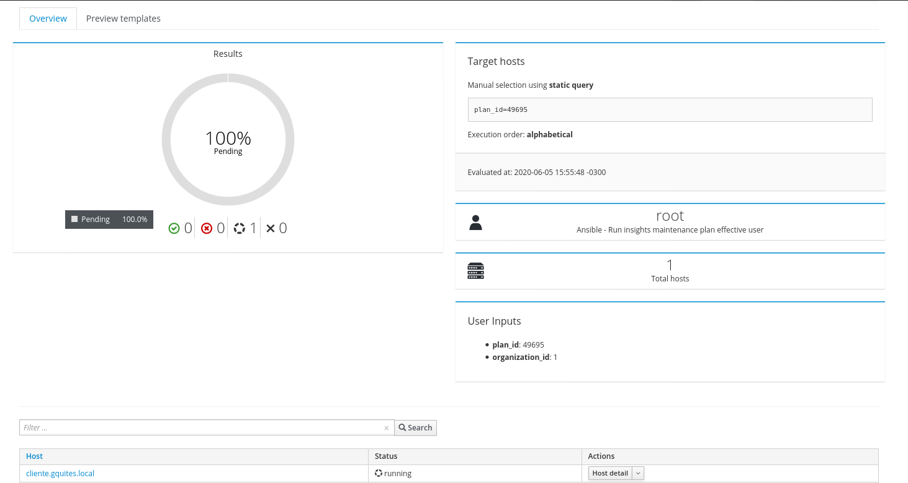
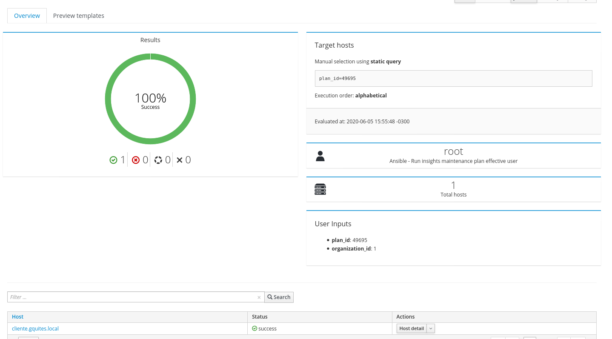
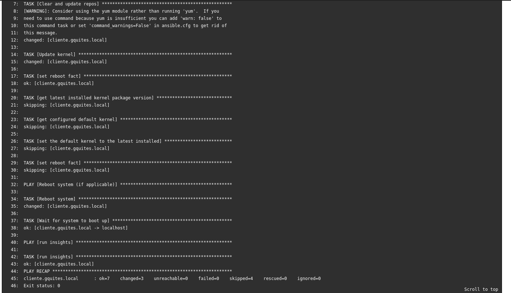
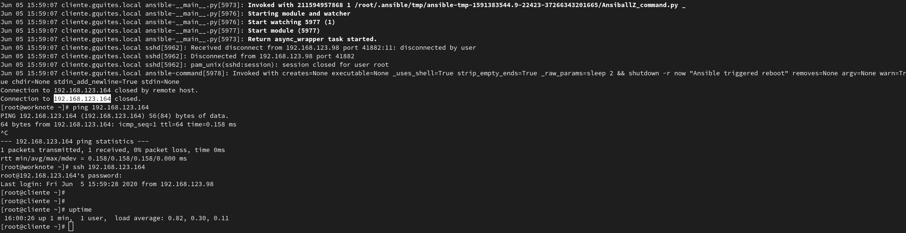

### Registrando os hosts no satellite:

Precisamos instalar o Red Hat insigths somente nas versões 7 later. Nas versões do RHEL 8, temos o insigts por default. Para registar o RHEL no Salellite ou Cloud.redhat.com:

Podemos fazer o registro do hosts no satellite atraves do Activation Key ou Bootstrap.py:

~~~~

[root@cliente ~]# curl https://sat66.gquites.local/pub/bootstrap.py > bootstrap.py --insecure
[root@cliente ~]# chmod +x bootstrap.py

~~~~

Depois execute o comando para fazer o registro:

~~~~

[root@cliente ~]# ./bootstrap.py -l admin -s sat66.gquites.local -o 'gquites.local' -L 'gquites' -a rhel7

~~~~

Executando via Activation Key:

~~~~
[root@cliente ~]# rpm -Uvh http://sat66.gquites.local/pub/katello-ca-consumer-latest.noarch.rpm 
Retrieving http://sat66.gquites.local/pub/katello-ca-consumer-latest.noarch.rpm
Preparing...                          ################################# [100%]
Updating / installing...
   1:katello-ca-consumer-sat66.gquites################################# [100%]
[root@cliente ~]#   
[root@cliente ~]# subscription-manager register --org="gquites" --activationkey="rhel7server"
The system has been registered with ID: c3d2c23c-ea2b-4b48-883d-1dd317a9bc70
The registered system name is: client.gquites.local
Installed Product Current Status:
Product Name: Red Hat Enterprise Linux Server
Status:       Subscribed
[root@cliente ~]#
~~~~

### Instalar o Insights Client e registrar:

Depois de registrar o hosts, precisamos validar se o repositorio foi ativado:

Para fazer pelo Satellite precisa do repositorio:

~~~~
[root@cliente ~]# yum repolist
Loaded plugins: enabled_repos_upload, package_upload, product-id, search-disabled-repos, subscription-manager
repo id                                                repo name                                                                      status
!rhel-7-server-insights-3-rpms/x86_64                  Red Hat Insights 3 (for RHEL 7 Server) (RPMs)                                        8
!rhel-7-server-rpms/x86_64                             Red Hat Enterprise Linux 7 Server (RPMs)                                        29,082
!rhel-7-server-satellite-tools-6.7-rpms/x86_64         Red Hat Satellite Tools 6.7 (for RHEL 7 Server) (RPMs)                              65
   
~~~~

Com o repositorio ativado. Vamos instalar o cliente o insigths e registrar.

~~~~
[root@cliente ~]# yum -y install insights-client  

[root@cliente ~]# insights-client --register 
This host has already been registered.
Automatic scheduling for Insights has been enabled.
Starting to collect Insights data for client.gquites.local
Uploading Insights data.
Successfully uploaded report from client.gquites.local to account 540155.
View the Red Hat Insights console at https://cloud.redhat.com/insights/

~~~~

### Conigurar a chave puglic do Satellite nos hosts remotos:

Os hosts remotos precisam ser configurados com a chave public do proxy smart. O ROOT é usado como usuário padrão para acessar hosts remotos via SSH. Você pode definir a configuração global remote_execution_ssh_user para alterar o padrão. Outra maneira é usar as configuraçoes globais para definir uma senha. 

As chaves ssh para os  smart proxies estão disponíveis como um parâmetro do host (remote_execution_ssh_keys). Isso permite que você gerencie as chaves autorizadas com sua plataforma de gerenciamento de configuração preferida ou através de um modelo de provisionamento.

Segue uma forma facil de copiar a chave para os clientes:

~~~~
[root@sat ~]# ssh-copy-id -i /var/lib/foreman-proxy/ssh/id_rsa_foreman_proxy.pub root@cliente.gquites.local
/usr/bin/ssh-copy-id: INFO: Source of key(s) to be installed: "/var/lib/foreman-proxy/ssh/id_rsa_foreman_proxy.pub"
The authenticity of host 'cliente.gquites.local (192.168.123.164)' can't be established.
ECDSA key fingerprint is SHA256:/t7BphgCX2Y/pUwEBG3s2RpYZgovl4jqJv6DhGSXaRQ.
ECDSA key fingerprint is MD5:e0:a9:9b:96:01:06:c0:68:35:7d:40:87:3c:e1:5f:41.
Are you sure you want to continue connecting (yes/no)? yes
/usr/bin/ssh-copy-id: INFO: attempting to log in with the new key(s), to filter out any that are already installed
/usr/bin/ssh-copy-id: INFO: 1 key(s) remain to be installed -- if you are prompted now it is to install the new keys
root@cliente.gquites.local's password: 

Number of key(s) added: 1

Now try logging into the machine, with:   "ssh 'root@cliente.gquites.local'"
and check to make sure that only the key(s) you wanted were added.

[root@sat ~]# 

~~~~

### Conigurar a chave public do Satellite nos hosts remotos:

Abra o Nabegador e acesse a URL do Satellite. Log com USER: admin PASS: redhat..123 e depois:

Acesse Hosts → All Hosts. Nessa lista, podemos ver o hosts que acabamos de registrar. 

Acesse Hosts → Content hosts podemos ver o status da subscrição e quantidade de pacotes para fazer update.

Depois de vermos o status do hosts. Podemos ir em Insights → Overview para ver todas as Actions Summary que podemos aplicar.

Vamos criar uma Action Planner para o hosts client como modelo.

Precisamos dar um nome para o Action Planner, informar em qual host vamos aplicar e quais os actions. Depois clicar em SAVE.  

Depois de criarmos o Action Planner. Podemos fazer algumas verifições no plano de execução. Podemos deixar o sistema reiniciar? O Hosts esta corrento em "Systems"? Tudo isso grarantido. Podemos executar o Run Playbook.

O Satellite vai conectar via ssh e rodar o playbook de configurações. Deixando o status como "pending"

Depois de executar com sucesso. Podemos ver o clicando no nome do hosts. 

A saída do playbook ficará disponivel no satellite. 

No terminal, deixei logado verificando os logs e se o hosts iria realmente reiciar:

